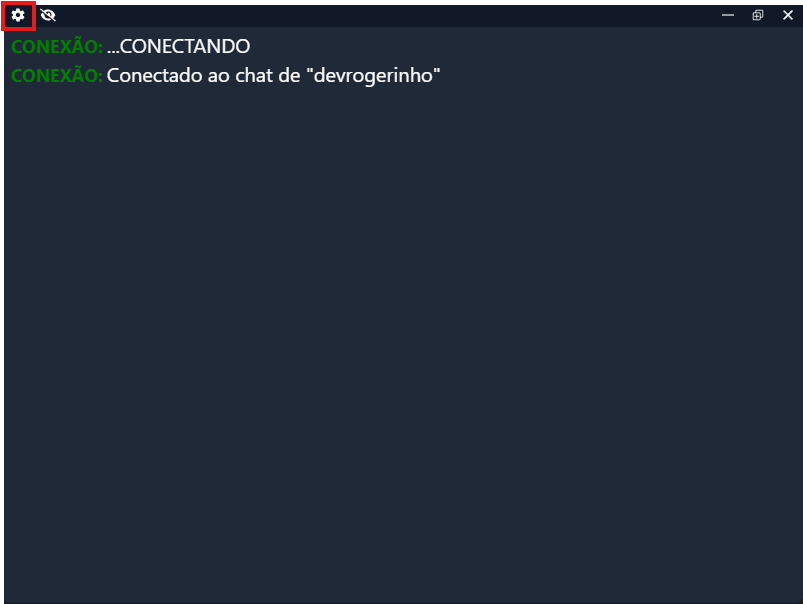
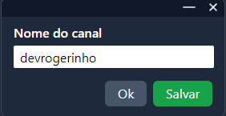
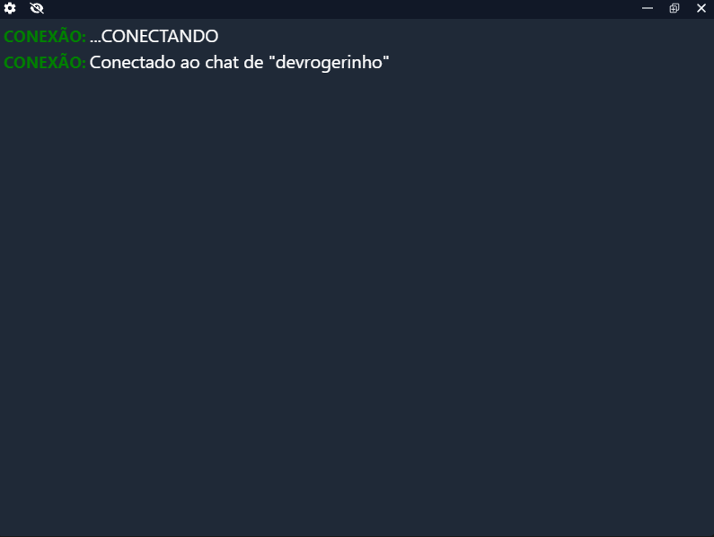
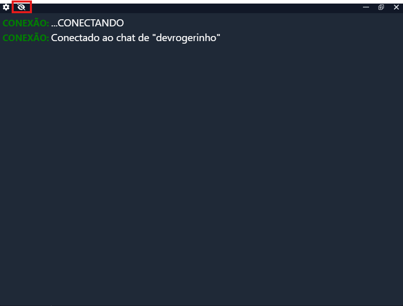

# Ingame Twitch Chat

Versao pessoal baseada no [BooChat](https://github.com/0rogerinho/boo-chat-tw) por [devrogerinho.com](https://devrogerinho.com).

Captura o chat da Twitch, YouTube e Kick e o exibe de forma transparente na tela. Ideal para streamers que desejam sobrepor o chat nas transmissoes sem fundo solido, permitindo melhor integracao com o jogo ou conteudo exibido.

## BooChatTW

BooChatTW captura o chat da Twitch e o exibe de forma transparente na tela. Ideal para streamers que desejam sobrepor o chat nas transmissões sem fundo sólido, permitindo melhor integração com o jogo ou conteúdo exibido.

## Download

Baixe a versao mais recente na [pagina de Releases](https://github.com/romulando/ingame-twitch-chat/releases).

[](https://github.com/romulando/ingame-twitch-chat/archive/refs/heads/master.zip)
[](https://github.com/romulando/ingame-twitch-chat/releases/latest/download/Ingame-Twitch-Chat-1.0.0-setup.exe)
[](https://github.com/romulando/ingame-twitch-chat/releases/latest/download/Ingame-Twitch-Chat-1.0.0.exe)


## 🚀 Plataformas Suportadas

- **Windows** (x64, x86)
- **macOS** (x64, ARM64)
- **Linux** (x64)

## 🛠️ Tecnologias

- **Electron** - Framework multiplataforma
- **React** - Interface do usuário
- **TypeScript** - Tipagem estática
- **Tailwind CSS** - Estilização
- **Vite** - Build tool

## 📋 Pré-requisitos

- Node.js 18+
- pnpm (recomendado) ou npm
- Git

## 🚀 Instalação e Desenvolvimento

### Instalar Dependências

```bash
pnpm install
```

### Modo Desenvolvimento

```bash
pnpm dev
```

### Build para Produção

```bash
# Build para todas as plataformas
pnpm run build:all

# Build específico por plataforma
pnpm run build:win    # Windows
pnpm run build:mac    # macOS
pnpm run build:linux  # Linux
```

### Scripts Disponíveis

```bash
# Desenvolvimento
pnpm dev              # Modo desenvolvimento
pnpm start            # Preview da build

# Build específico
pnpm build:win        # Windows (NSIS + Portable)
pnpm build:win:portable # Apenas versão portable
pnpm build:mac        # macOS (DMG + ZIP)
pnpm build:mac:arm64  # macOS ARM64
pnpm build:mac:x64    # macOS x64
pnpm build:linux      # Linux (AppImage, DEB, SNAP, RPM)
pnpm build:linux:appimage # Apenas AppImage
pnpm build:linux:deb  # Apenas DEB
pnpm build:linux:snap # Apenas SNAP
pnpm build:linux:rpm  # Apenas RPM

# Utilitários
pnpm typecheck        # Verificação de tipos
pnpm lint             # Linting
pnpm format           # Formatação de código
```

## 📖 Documentação

- [Guia de Build](docs/BUILD.md) - Instruções detalhadas para build
- [Configuração da API do YouTube](docs/YOUTUBE_API_SETUP.md) - Setup da API


## Como Utilizar

- Baixe e instale o executável.

- Abra o aplicativo.


- Acesse a seção Configurações e insira o nome do canal da Twitch.




- Pronto! O chat será capturado e exibido automaticamente na tela.



- Para deixar o chat Transparent ou fazê-lo voltar a aparecer você pode usar ```CTRL + ALT + A``` ou clicar no olhinho

